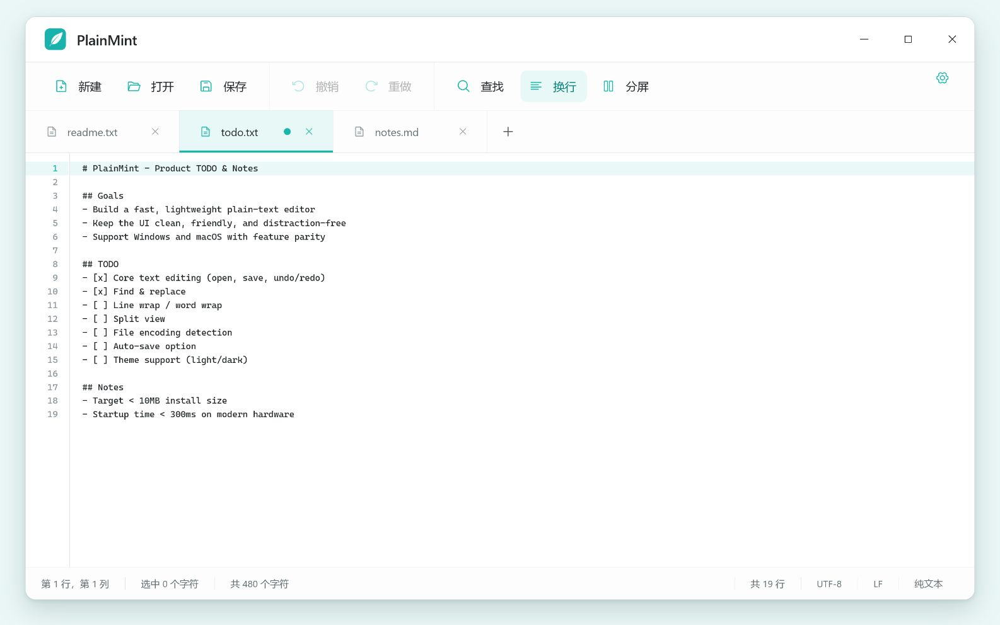

<div align="center">
  

  <h1>PlainMint</h1>
  <p>
    <strong>纯文本，清爽简单。</strong><br>
    <em>Plain text, freshly simple.</em>
  </p>

  <p>
    <a href="https://github.com/isunky/PlainMint/releases"></a>
    <a href="https://github.com/isunky/PlainMint/actions/workflows/ci.yml"></a>
    <a href="LICENSE"></a>
  </p>

  <p>
    <a href="https://github.com/isunky/PlainMint/releases"><strong>下载 / Download</strong></a>
    ·
    <a href="#zh-cn">简体中文</a>
    ·
    <a href="#english">English</a>
  </p>
</div>

<p align="center">
  
</p>

<a id="zh-cn"></a>

## 简体中文

PlainMint 是一款轻量、可靠的 Windows 与 macOS 纯文本编辑器。专注写作与文本处理，不需要账户，也不会上传文件。

### 核心功能

- **高效编辑** — 多标签、左右分屏、查找替换、撤销重做
- **安全可靠** — 自动备份、会话恢复、外部文件变更检测
- **格式兼容** — 保留 UTF-8 / UTF-16 编码与 LF / CRLF / CR 换行格式
- **舒适易用** — 自动换行、行号、明暗主题、五种强调色
- **中英双语** — 支持简体中文与 English，可跟随系统语言

### 下载

前往 [GitHub Releases](https://github.com/isunky/PlainMint/releases) 下载 Windows 安装程序或 macOS DMG。

> 文件始终保存在本机。当前构建未进行商业代码签名，首次运行时系统可能显示安全提示。

---

<a id="english"></a>

## English

PlainMint is a lightweight, reliable plain-text editor for Windows and macOS. It stays focused on writing and text work—no account required, and no files are uploaded.

### Highlights

- **Efficient editing** — Tabs, split view, find and replace, undo and redo
- **Safe by default** — Automatic backups, session recovery, external-change detection
- **Format friendly** — Preserves UTF-8 / UTF-16 and LF / CRLF / CR
- **Comfortable UI** — Word wrap, line numbers, light and dark modes, five accents
- **Bilingual** — Simplified Chinese and English with system-language detection

### Download

Get the Windows installer or macOS DMG from [GitHub Releases](https://github.com/isunky/PlainMint/releases).

> Your files stay on your device. Current builds are unsigned, so your system may show a security warning on first launch.

---

## 开发 / Development

需要 / Requires: Node.js 22, Rust stable, and [Tauri 2 prerequisites](https://v2.tauri.app/start/prerequisites/).

```bash
git clone https://github.com/isunky/PlainMint.git
cd PlainMint/app
npm install
npm run tauri:dev
```

```bash
npm run check          # 类型检查与测试 / Type checks and tests
npm run tauri:build    # 构建安装包 / Build desktop installers
```

<details>
<summary><strong>发布 / Release</strong></summary>

在 GitHub Actions 中手动运行 **Release**，选择 `patch`、`minor` 或 `major`。工作流会自动生成版本号并发布 Windows 与 macOS 安装包。

Run **Release** manually in GitHub Actions and choose `patch`, `minor`, or `major`. The workflow calculates the next version and publishes Windows and macOS installers.

</details>

## License

[Apache License 2.0](LICENSE)
